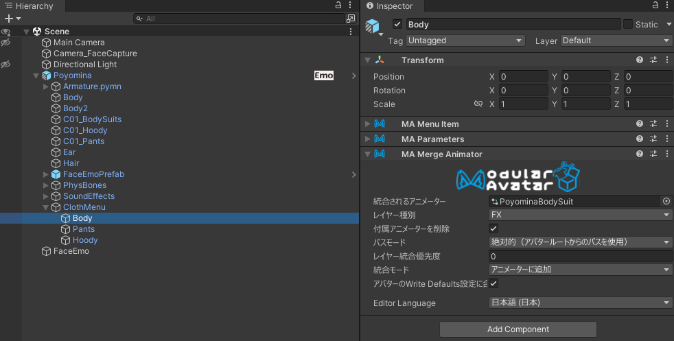
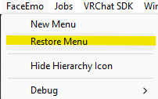
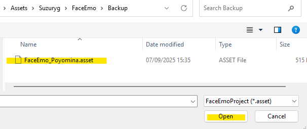
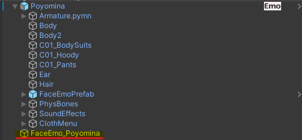

# Modification Guide

## Folder Structure
Located under `Assets/00_Murixir/06_Poyomina/`:

| Folder / File            | Description |
| ------------------------ | ----------- |
| `Poyomina.prefab`        | **Preset1 (Tiger)** main prefab. |
| `Poyomina_Blank.prefab`  | **Blank version** without outfit or outfit animator; recommended for customization. |
| `01_FBX`                 | **Model FBX files** used by all prefabs. |
| `02_Materials`           | **Material storage** based on lilToon. Base materials (Preset1 + shared) are directly under this folder; Preset2 and Preset3 have their own subfolders. |
| `03_Textures`            | **Textures** (color, masks, matcap, etc.). Base colors for each preset are also here. |
| `04_Controllers`         | **Animator controllers and menus.** Root assets handle BodyAdjust. `C01_DefaultCloth` contains controllers/menus for the default outfit. |
| `05_FaceAnimations`      | **Expression sets** (FaceEmo-compatible). Each set in its own folder. |
| `06_OtherAnimations`     | **Auxiliary animations** for ears, claws, body shape, sounds, etc. Includes BodyControl and claw controllers. |
| `08_SoundEffects`        | **Sound effects** triggered by expressions and gimmicks. |
| `09_Particles`           | **Particle assets** (includes unused ones). |
| `10_Presets`             | **Prefab storage for presets**: Preset2 (Leopard) and Preset3 (Cat). |

## Presets
Three visual presets share the same internal structure (model, bones, features, expressions, gimmicks); only materials differ.

| Preset | Motif | Location | Notes |
| ------ | ----- | -------- | ----- |
| Preset1 | Tiger | `06_Poyomina/Poyomina.prefab` | Base prefab. |
| Preset2 | Leopard | `06_Poyomina/10_Presets/Preset2/Poyomina.prefab` | Prefab variant with materials swapped. |
| Preset3 | Cat | `06_Poyomina/10_Presets/Preset3/Poyomina.prefab` | Prefab variant with materials swapped. |

### 🧱 About the Blank Versions
Each preset includes a **Blank version** without clothes or outfit animator—ideal for modifications. Using **`Preset1_Blank`** as a base is recommended.

| Blank Prefab | Location |
| ------------ | -------- |
| `Poyomina_Blank` (Preset1) | `06_Poyomina/Poyomina_Blank.prefab` |
| `Poyomina_Blank` (Preset2) | `06_Poyomina/10_Presets/Preset2/Poyomina_Blank.prefab` |
| `Poyomina_Blank` (Preset3) | `06_Poyomina/10_Presets/Preset3/Poyomina_Blank.prefab` |

Blank versions still include BodyAdjust. If you don’t need it, remove `PoyominaMainBody.controller` from the FX slot of the VRC Avatar Descriptor. In that case, reset Expressions to default to remove menus and parameters. If setting your own expressions, see [Point 3: Setting expressions without FaceEmo](#-point-3-setting-expressions-without-faceemo).

## Prefab & Animator Structure
Poyomina uses multiple animators and menu groups separated by function.

### 🧱 Prefab Structure and Component Roles
Main objects directly under `Poyomina.prefab`:

| Object | Role |
| ------ | ---- |
| `Armature.pymn` | Standard Humanoid bone structure. |
| `FaceEmoPrefab` | Sub-prefab for FaceEmo control; contains expression animator and menu. |
| `PhysBones` | PhysBone settings for each body part (hair, ears, chest, etc.). |
| `SoundEffects` | SEs used by BodyControl’s NippleAuto. |
| `ClothMenu` | For outfit parts (`C01_BodySuits`, `C01_Hoody`, `C01_Pants`): • Shape key control • On/off animations • Corresponding expression menus |

The Avatar Descriptor holds BodyControl menu/parameters and shape-key animator assignments.

### 🧩 Overview of Animator Structure
All Poyomina animations use **Write Defaults = ON**.

- **BodyControl Parameter Animators**  
  Controlled mainly through BodyAdjust toggle/slider parameters.  
  `PoyominaMainBody.controller` includes:

  | Layer | Description |
  | ----- | ----------- |
  | Base Layer | Unused. |
  | P.BreastController | Adjusts chest shape via `P.BreastSize`. |
  | P.BreastPBController | Adjusts chest PhysBone positions via `P.BreastSize`. |
  | P.BellyController | Adjusts belly shape via `P.Pregnant`. |
  | P.NippleController | Toggles nipples via `P.Nipple`; controls stages via `P.Nipple_F`. |
  | P.BreastTouch | Uses nearby collider to control `P.Nipple_F`. |
  | P.ClawController | Adjusts claw shape via `P.Claw`. |
  | P.ClawTouch | Uses hand position/signs to control `P.Claw` via `P.ClawAuto`. |

  These parameters enable simple control of default outfit animations.

- **Outfit Part Animators**  
  Each outfit piece (BodySuits, Hoody, Pants, etc.) has independent shape-key/visibility animations. Unneeded parts can be removed individually. For example, deleting the ClothMenu/Body component removes menu and animation for the bodysuit.  
  

- **Expression Control via FaceEmo**  
  Expression control follows Suzuryg’s [FaceEmo](https://suzuryg.github.io/face-emo/) structure. FaceEmo animators are kept within `FaceEmoPrefab`, separate from the main body.

## Expression Modification Guide
Poyomina uses the external [FaceEmo](https://suzuryg.github.io/face-emo/) package. Follow FaceEmo documentation for adding or changing expressions. Detailed FaceEmo instructions are omitted here; common stumbling points are summarized below.

### ✅ Point 1: Restoring Menus
To restore default menus:

> Place `Poyomina.prefab` in the scene.  
> From Unity’s menu choose `FaceEmo/Restore Menu`.  
> Select `Suzuryg/FaceEmo/Backup/FaceEmo_Poyomina.asset`.  
> FaceEmo_Poyomina appears in the scene when successful.

### ✅ Point 2: Setting Animation Target References
When animating PhysBones or toggle objects with expressions, **ensure the target objects are referenced** in FaceEmo settings. Otherwise issues like stuck tongues or unresponsive expressions may occur.

> In the Inspector for `FaceEmo_Poyomina`, confirm **Additional Expression Object (Toggle)** and **Additional Expression Object (Transform)** are set as shown.

### ✅ Point 3: Setting Expressions without FaceEmo
To create your own expression system without FaceEmo, simply remove FaceEmo control:

> Delete `FaceEmoPrefab` from within `Poyomina.prefab`.

You can then replace it with your own menus and animators.
