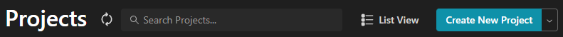
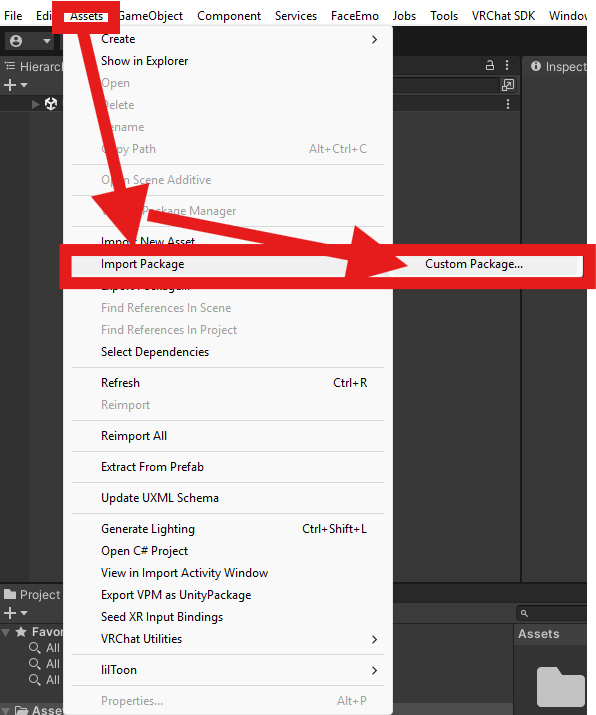
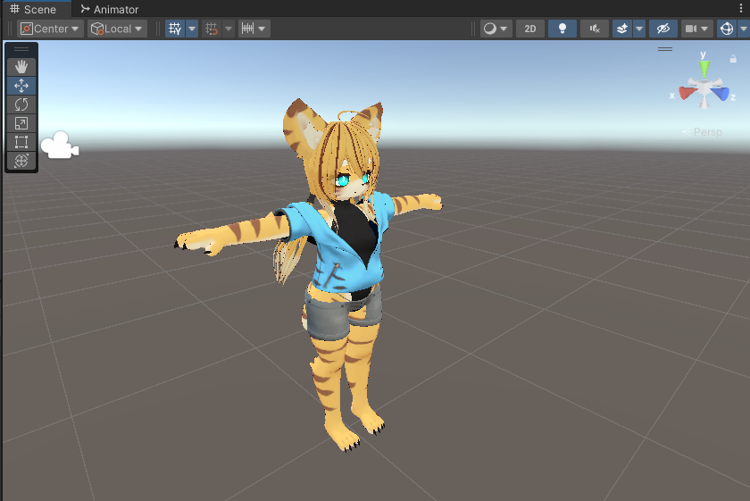
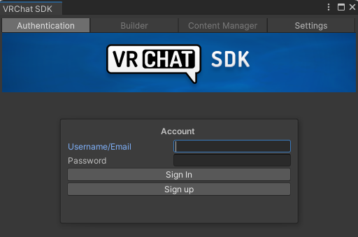

# Setup (Uploading to VRChat)

## 1. Preparation
- Download and install [Unity (2022.3.22f1)](https://unity.com/download).
- Install the **[VRChat Creator Companion](https://unity.com/download)** (VCC).
  

## 2. Add Required Packages
Use VCC to add these packages:
- **Required Packages**
  - [lilToon](https://lilxyzw.github.io/lilToon/): choose “Add to VCC” on the web page and follow the prompts to add the repository.
  - [FaceEmo](https://suzuryg.github.io/face-emo/): choose “Download (VCC)” and follow the prompts to add the repository.
  - [Modular Avatar](https://modular-avatar.nadena.dev/): choose “Download” and follow the prompts to add the repository.

## 3. Create a New Project in VCC
Click **Create New Project** in the upper-right corner. On the next screen choose **Unity2022 Avatar Project**, set any project name, and create the project.

## 4. Install Required Packages
After the project is created, select **Manage Project** and install lilToon, Modular Avatar, and FaceEmo (choose the latest version from the “Not Installed” dropdown).  
If the packages do not appear, redo [2. Add Required Packages](#_2-add-required-packages).

All three packages should be installed as shown:

## 5. Import Poyomina
- Choose **Open Project** and open the project; Unity will launch.

- In Unity, select **Assets → Import Package → Custom Package**.

- Specify the distribution file **`PoyominaVerxxx.unitypackage`** (xxx = version). Click **Import**.

- When import completes, a `00_Murixir/06_Poyomina` folder is added to the Assets.

## 6. Place in the Scene
Drag one of the following `Poyomina.prefab` (or `Poyomina_Blank.prefab` for the blank version) into the **Hierarchy**:
- `Assets/00_Murixir/06_Poyomina/` → **Poyomina.prefab** (Tiger version)
- `Assets/00_Murixir/06_Poyomina/10_Presets/Preset2/` → **Poyomina.prefab** (Leopard version)
- `Assets/00_Murixir/06_Poyomina/10_Presets/Preset3/` → **Poyomina.prefab** (Cat version)

If successful, Poyomina will appear in the scene.

## 7. Upload
- In Unity, open **VRChat SDK → Show Control Panel** and log in with your VRChat ID.

- After logging in, you can fill in avatar information on the **Builder** tab. Set Name, Visibility, and a thumbnail, then upload.

> ⚠️ **Important**  
> Set **Visibility** to **Private**. Setting it to **Public** violates the terms!

- From **Builder**, run **Build & Publish for Windows**.
- Upload completes. Thank you for your work!
