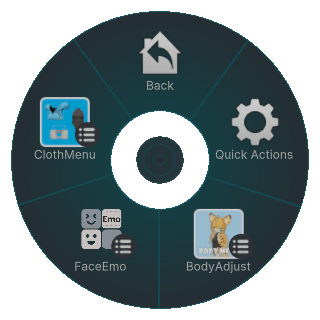
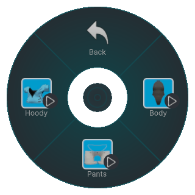
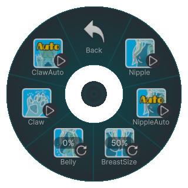
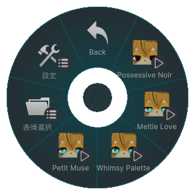
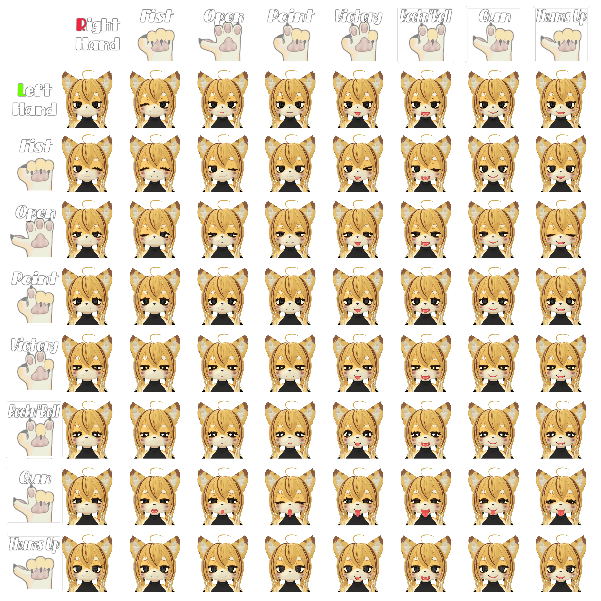

# Basic Usage
This chapter explains how to operate Poyomina’s expressions and body gimmicks.

---

## Expression Menu
Poyomina has three Expression Menus:

- **ClothMenu** – Toggle the default outfit on/off.
- **BodyAdjust** – Adjust body features using blendshapes.
- **FaceEmo** – Switch expression sets or play animations.

---

## ClothMenu (Outfit)
Toggle the following items:

- **Hoody** – Put on/off the hoodie.
- **Pants** – Put on/off the pants.
- **Body** – Toggle the inner suit.

---

## BodyAdjust (Body Shape)
Adjust via toggles and sliders:

- **Claw** – ON extends claws; OFF retracts.
- **Claw Auto** – Perform Fist → Open gesture in front of face to auto extend/retract claws.
- **Nipple** – ON makes nipples appear.
- **Nipple Auto** – When OFF, touching the nipple grows it through 20 stages until it switches ON.
- **BreastSize** – Adjust chest size with a slider.
- **Belly** – Adjust belly size with a slider.

---

## FaceEmo (Expression Sets)
Choose one of four expression sets:

- **Petit Muse** – Seven simple basic expressions; beginner-friendly.  
  

- **Whimsy Palette** – 64 expressions triggered by left/right gesture combos; advanced, catalog-like variety.  
  

- **Meltie Love** – Pupils become hearts for a sweet, enamored look.  
  

- **Possessive Noir** – Eyes turn pitch black, giving an obsessive “yandere” vibe.  
  

---

## Operating FaceEmo
Refer to the official documentation for basic FaceEmo usage:

👉 [FaceEmo Operation Guide (Setting Menu)](https://suzuryg.github.io/face-emo/docs/optional-functions/setting-menu/)

*The same page also covers the dance gimmick.*  
*Known issue: During dance gimmicks, the Body Adjust “Breast Size” slider may not work correctly. If you need different default proportions when using dance gimmicks, see the Modification Guide and setup and apply default proportion as you wish.*
