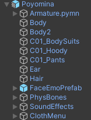
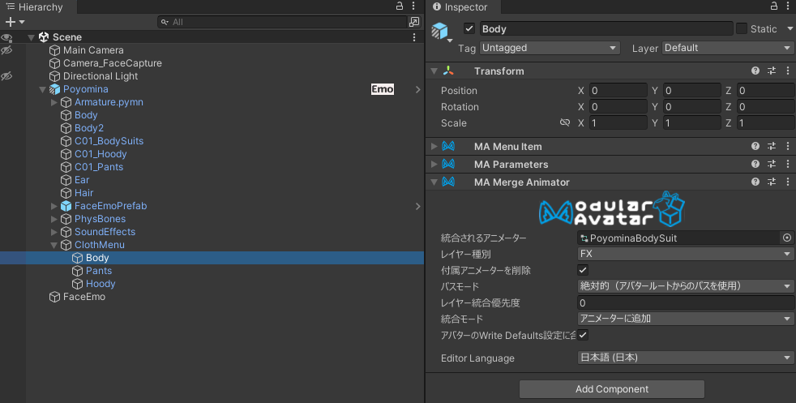
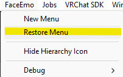
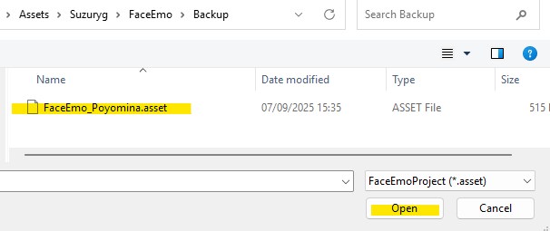
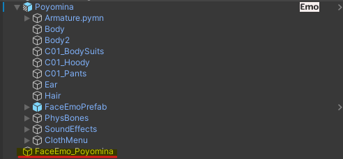
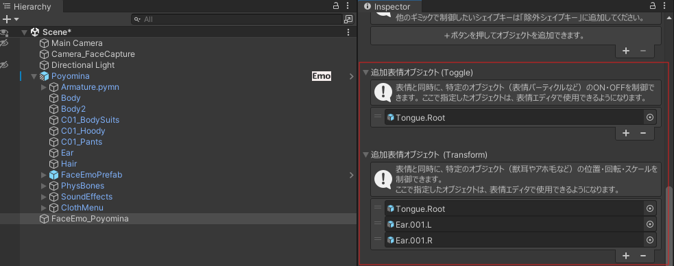

# 改変ガイド

## フォルダ構成

以下は `Assets/00_Murixir/06_Poyomina/` 以下に配置されたフォルダ構成です。  
それぞれの用途・目的を右欄に記載しています。

| フォルダ名              | 説明                                                         |
| ----------------------- | ------------------------------------------------------------ |
| `Poyomina.prefab`       | **Preset1（虎）本体のPrefab**。06_Poyomina直下に配置されています。 |
| `Poyomina_Blank.prefab` | **衣装・衣装アニメーター除去済みのBlank版Prefab**。改変用ベースに推奨。 |
| `01_FBX`                | **モデルFBXファイル本体**。すべてのPrefabのベースとなります。 |
| `02_Materials`          | **マテリアル格納フォルダ**。lilToonベースで構成されています。直下にベースとなるPreset1および共通のマテリアル、Preset2, Preset3以下に各プリセットのマテリアルが格納されています。 |
| `03_Textures`           | **各種テクスチャ**（カラー・マスク・マットキャップなど）を格納。 PresetsごとのBaseColorもここにあります。 |
| `04_Controllers`        | **Animator Controllerおよびメニュー群**。 直下のアセットはBodyAdjustを制御するコントローラとメニューです。 C01_DefaultCloth以下にはデフォルトの衣装の切り替え用のコントローラとメニューです。 |
| `05_FaceAnimations`     | **表情セット**（FaceEmo対応）。 各表情セットごとにフォルダが分かれています。 |
| `06_OtherAnimations`    | **耳・ツメ・体型・音など補助アニメーション全般**。 BodyControlやClaw制御。 |
| `08_SoundEffects`       | **SE（効果音）ファイル群**。表情やギミックで再生される音素材です。 |
| `09_Particles`          | **パーティクル素材**。未使用のものも含みます。               |
| `10_Presets`            | **プリセット別のPrefab格納先**。Preset2（豹）、Preset3（猫）が含まれます。 |

## プリセット構成

Poyominaには、外見の異なる3種類のプリセットが用意されています。  
いずれも内部構造（モデル・ボーン構成・機能・表情・ギミックなど）は共通であり、**見た目（マテリアル）だけが異なる**構成です。

| プリセット名 | モチーフ | フォルダ位置                                     | 備考                                                         |
| ------------ | -------- | ------------------------------------------------ | ------------------------------------------------------------ |
| Preset1      | 虎       | `06_Poyomina/Poyomina.prefab`                    | 本体プレハブ。                                               |
| Preset2      | 豹       | `06_Poyomina/10_Presets/Preset2/Poyomina.prefab` | Preset1のPrefab Variant。マテリアルのみ変更。内部構成は共通。 |
| Preset3      | 猫       | `06_Poyomina/10_Presets/Preset3/Poyomina.prefab` | Preset1のPrefab Variant。マテリアルのみ変更。内部構成は共通。 |

---

### 🧱 Blank版について

各プリセットには、衣装と衣装アニメーターを除去した **Blank版** が同梱されています。  
改変用途に適しており、**とくに `Preset1_Blank` をベースに作業するのがおすすめ**です。

| Blankプレハブ名          | フォルダ位置                                           |
| ------------------------ | ------------------------------------------------------ |
| Poyomina_Blank (Preset1) | `06_Poyomina/Poyomina_Blank.prefab`                    |
| Poyomina_Blank (Preset2) | `06_Poyomina/10_Presets/Preset2/Poyomina_Blank.prefab` |
| Poyomina_Blank (Preset3) | `06_Poyomina/10_Presets/Preset3/Poyomina_Blank.prefab` |

---
## Prefabとアニメーターの構成

Poyominaには、機能ごとに細かく分離された複数のアニメーターとメニュー群が組み込まれています。  
このセクションでは、アニメーター構成の全体像と、Prefab内部の関連コンポーネント配置について解説します。

---
### 🧱 Prefab構成と各コンポーネントの役割

以下は、Poyominaプレハブ内部の構成です：  
`Poyomina.prefab` 直下に主要な機能オブジェクトがまとめられています。

| オブジェクト名  | 内容・補足                                                   |
| --------------- | ------------------------------------------------------------ |
| `Armature.pymn` | 通常のHumanoidボーン構造です。                               |
| `FaceEmoPrefab` | FaceEmo制御用のサブプレハブ。表情制御用のアニメーター・メニューが含まれています。 |
| `PhysBones`     | 各部位に対応したPhysBoneの設定（髪・耳・胸など）             |
| `SoundEffects`  | BodyControlのNippleAuto機能で使用されるSEが格納されています。 |
| `ClothMenu`     | 各衣装パーツ（`C01_BodySuits`, `C01_Hoody`, `C01_Pants`）に関連する： ・シェイプキー制御 ・表示/非表示切り替えアニメーション ・対応Expression Menu |

Avatar Descriptor直下には、BodyControl用のメニューとパラメーター定義、本体に対するシェイプキー制御アニメーターが割り当てられています。

---

### 🧩 アニメーター構成の概要

Poyominaのアニメーター構成は以下のようになっています。**PoyominaのアニメーションはすべてWrite Defaults = ONで構成されています。**

- **BodyControl用パラメータ制御**  
  主にBodyAdjustメニューで操作されるトグル／スライダー系のパラメータ制御。

  **🗂 PoyominaMainBody.controller**には、以下のようなレイヤー構成が含まれています。
  
  | レイヤー名           | 説明                                                         |
  | -------------------- | ------------------------------------------------------------ |
  | Base Layer           | 使用していません。                                           |
  | P.BreastController   | パラメータ `P.BreastSize` を参照して胸のシェイプキーを調整します。 |
  | P.BreastPBController | パラメータ `P.BreastSize` を参照して、胸の当たり判定（PhysBone位置）を調整します。 |
  | P.BellyController    | パラメータ `P.Pregnant` を参照して、おなかのシェイプキーを調整します。 |
  | P.NippleController   | パラメータ `P.Nipple` を参照してちくびのON/OFF切り替えを行います。 また `P.Nipple_F` を参照して、ちくびのシェイプキー段階を制御します。 |
  | P.BreastTouch        | ちくび付近のCollider（接触判定）を参照して、`P.Nipple_F` の値を制御します。 |
  | P.ClawController     | パラメータ `P.Claw` を参照して爪のシェイプキーを調整します。 |
  | P.ClawTouch          | パラメータ `P.ClawAuto` を参照して、手の位置とハンドサインに応じて `P.Claw` の値を制御します。 |
  
  各種状態遷移はパラメータに反映されるため、これらのパラメータを参照することでデフォルト服のアニメーションをシンプルに制御しています。
  
- **各服パーツごとのアニメーター**  
  BodySuits, Hoody, Pantsなど、衣装ごとに独立したシェイプキー制御／表示非表示切替アニメーションを保持しており、不要なパーツを個別に削除することが可能です。例えば、Prefab内のClothMenu/Bodyにはインナーのボディスーツ用のMA Menu Item、MA Parameters および MA Merge Animaorコンポーネントがついており、これ単体を削除することでボディスーツ用のメニューとアニメーションを削除することができます。

- **FaceEmoによる表情制御**  
  表情制御は、Suzuryg氏の[FaceEmo](https://suzuryg.github.io/face-emo/)に準拠した構成になっており、表情セット（Petit Muse など）の切り替えやアニメーション再生を専用アニメーターで行います。  
  FaceEmo用のアニメーターは `FaceEmoPrefab` にまとめられており、本体とは独立して管理されています。

---

## 表情改変ガイド

Poyominaの表情制御は、Suzuryg氏による外部パッケージ [FaceEmo](https://suzuryg.github.io/face-emo/) を使用して構築されています。  
そのため、表情の追加・改変は基本的に **FaceEmoのドキュメント** に従って行う必要があります。

本マニュアルでは、**FaceEmo自体の使用方法や構築手順の詳細な解説は行いません**。  
ただし、改変時に特につまづきやすいポイントを以下にまとめます。

---

### ✅ ポイント1：メニューの復元

デフォルトのメニューを復元して設定を行うために以下の手順に従ってバックアップファイルからメニューを復元してください。

> PoyominaのPrefabをシーンに配置します。
>
> UnityのMenuから`FaceEmo/Restore Menu`を選択してください。
>

`Suzuryg/FaceEmo/Backup/FaceEmo_Poyomina.asset`を選択してください

SceneにFaceEmo_Poyominaがロードされれば成功です。

---

### ✅ ポイント2：アニメーション対象オブジェクトの参照設定

**PhysBoneやToggleオブジェクトを表情と連動してアニメーションさせる場合**、FaceEmo設定内で **対象オブジェクトの参照設定** が必要です。  
これを忘れると以下のような不具合が発生する可能性があります：

- 舌が出たまま戻らない  
- 瞳の表現が切り替わらない  
- 特定表情だけ反応しない

FaceEmoの「表情の設定」画面で、**対象GameObjectやPhysBoneコンポーネントを正しく設定**してください。

> FaceEmo_PoyominaのInspectorを確認し、追加表情オブジェクト(Toggle)および追加表情オブジェクト(Transform)が画像のように設定されていることを確認してください。

---

### ✅ ポイント3：FaceEmoを使わず表情を設定したい場合

FaceEmoを使用せず、自作のメニューとAnimatorで表情を組みたい場合は、**FaceEmo制御をPrefabから削除するだけ**で置き換えが可能です。

> `Poyomina.prefab` 内の `FaceEmoPrefab` を削除してください。

これにより、FaceEmoによる制御が無効化され、独自の表情制御が可能になります。  