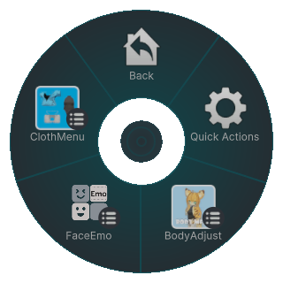
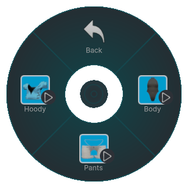
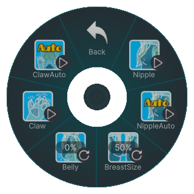
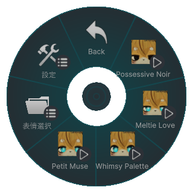
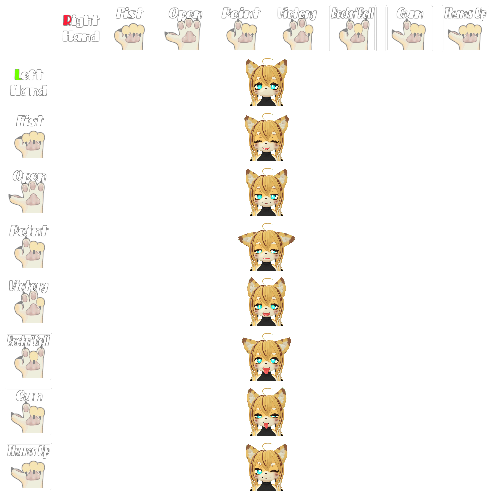
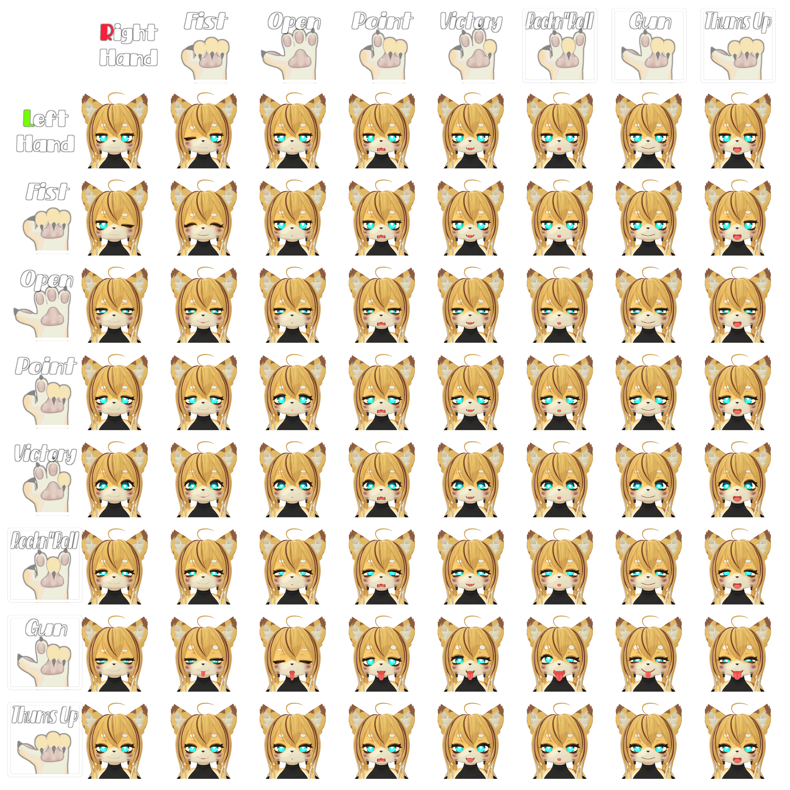
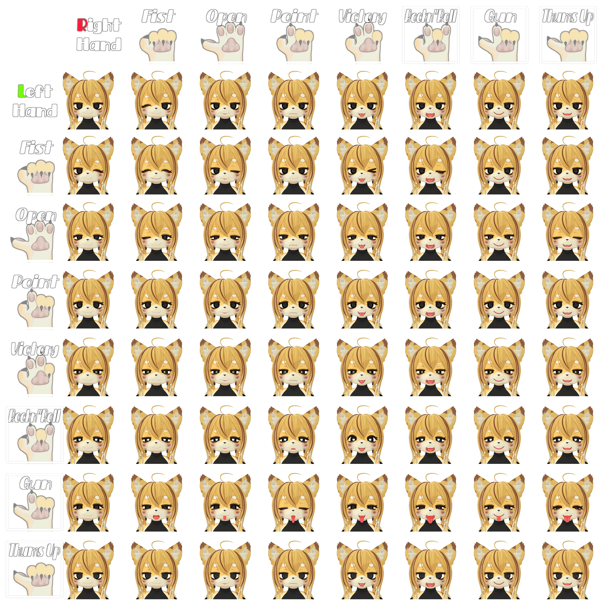

# 基本操作

この章では、Poyominaの表情や身体ギミックなど、主なインタラクション操作について解説します。

---

## Expression Menu（表情・ギミック操作）

Poyominaは以下の3つのExpression Menuを備えています：

- **ClothMenu**  
  デフォルト衣装のON/OFFを切り替えます。

- **BodyAdjust**  
  シェイプキーによる身体的特徴の調整を行います。

- **FaceEmo**  
  表情セットの切り替えや、アニメーションの再生を行います。

---

## ClothMenu（衣装）

ClothMenuでは以下の項目をトグルでON/OFFできます：

- **Hoody**：パーカーの着脱  
- **Pants**：ズボンの着脱  
- **Body**：インナーのON/OFF  

---

## BodyAdjust（体型調整）

BodyAdjustではシェイプキーとトグルで以下の調整が可能です：

- **Claw**：ONにするとツメが出ます。OFFで引っ込みます。  
- **Claw Auto**：顔の前で Fist → Open のジェスチャーでツメを出し入れできます。  
- **Nipple**：ONにすると乳首がぷっくりします。  
- **Nipple Auto**：OFF時に乳首に触れることで20段階に成長し、最終的にONに切り替わります。  
- **BreastSize**：胸のサイズをスライダーで調整します。  
- **Belly**：おなかのサイズをスライダーで調整します。

---

## FaceEmo（表情セット切り替え）

FaceEmoでは以下の4種類の表情セットから1つを選んで使用できます：

- **Petit Muse**  
  シンプルな7種の基本表情。初心者向け。  
  
- **Whimsy Palette**  
  64種類の表情を左右のジェスチャーの組み合わせで発動可能な上級者向けセット。  
  表情のカタログのように豊富なバリエーションを提供します。  
  
- **Meltie Love**  
  瞳孔が♡になり、甘々で夢中な表情に切り替わります。  
  
- **Possessive Noir**  
  瞳が真っ黒になり、執着心をにじませたメンヘラ風の表情に切り替わります。  
  

---

## FaceEmo の操作方法について

FaceEmoの基本操作については、以下の公式ドキュメントをご参照ください：

👉 [FaceEmo 操作ガイド（Setting Menu）](https://suzuryg.github.io/face-emo/ja/docs/optional-functions/setting-menu/)

※ ダンスギミックの使用方法についても上記ページ内で解説されています。

※ 既知の不具合として、ダンスギミック中にBody AdjustギミックのBreast Sizeが正常に動作しないことを確認しています。Breast Size変更状態でダンスギミックを使う場合は後述の改変ガイドを参考にデフォルト体型を変更してください。